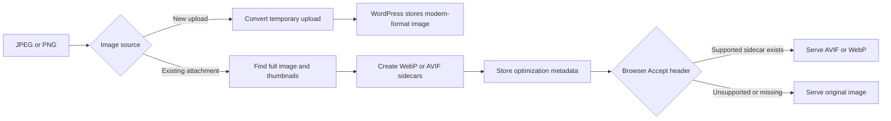

# WebPify Image Optimization

WebPify is a WordPress plugin that converts JPEG and PNG images to WebP or AVIF and can serve those optimized files to compatible browsers without changing image URLs in themes or post content.

This document explains the problem the plugin solves, how the implementation works, how to operate it, and how to verify the result. It describes the current code rather than an idealized feature set.

## The Problem

JPEG and PNG files are often larger than equivalent WebP or AVIF files. Large images increase transfer size, slow page rendering, and can negatively affect Core Web Vitals.

Solving this in WordPress involves three separate concerns:

1. **Conversion:** Create a modern-format image from a JPEG or PNG.
2. **Media management:** Process the original attachment and all WordPress-generated image sizes without losing track of the files.
3. **Delivery:** Serve WebP or AVIF only when the browser supports it, while retaining the original image as a fallback.

WebPify handles these concerns through the GD extension, WordPress attachment metadata and WP-Cron, and Apache or Nginx rewrite rules.

## Solution Overview



There is an important difference between the two conversion paths:

| Workflow | Result | Original retained? | WebPify metadata? |
| --- | --- | --- | --- |
| New upload | The temporary JPEG/PNG is overwritten with WebP or AVIF before WordPress stores it | No | No |
| Existing media | A `.webp` or `.avif` sidecar is written beside each original file | Yes | Yes |

## Requirements

- WordPress 6.8 or newer.
- PHP 7.4 or newer.
- The PHP GD extension with JPEG, PNG, and WebP support.
- PHP 8.1 or newer with the GD `imageavif()` function to use AVIF.
- Write access to the WordPress uploads directory.
- A functioning WP-Cron system for bulk optimization.
- Apache with rewrite, headers, MIME, and environment modules, or Nginx configured to include the generated WebPify rules.
- Composer dependencies installed so `vendor/autoload.php` is available.

Check the relevant GD capabilities with:

```bash
php -r 'var_export([
    "gd" => extension_loaded("gd"),
    "webp" => function_exists("imagewebp"),
    "avif" => function_exists("imageavif"),
]); echo PHP_EOL;'
```

If AVIF is unavailable, the plugin falls back to WebP during conversion.

## Configuration

Activate WebPify and open **Settings > WebPify** in WordPress admin.

The plugin stores its configuration in the `webpify_settings` option:

| Setting | Value | Meaning |
| --- | --- | --- |
| `format` | `1` | Generate WebP files |
| `format` | `2` | Generate AVIF files when PHP supports AVIF |
| `display` | `1` | Do not create frontend rewrite rules |
| `display` | `2` | Add frontend rewrite rules |

WebP is the default conversion format. Frontend delivery rules are disabled by default.

Selecting a format controls future conversions. Changing the format does not automatically reprocess attachments that are already marked as optimized.

## New Upload Processing

The upload path is registered on WordPress's `wp_handle_upload_prefilter` hook and is implemented by `Media::image_optimization()` in [`Includes/Admin/Media.php`](Includes/Admin/Media.php). The original misspelled method remains as a compatibility alias.

The process is:

1. Read the selected output format from `webpify_settings`.
2. Validate the file's real MIME type and continue only for JPEG or PNG.
3. Decode the image with `imagecreatefromjpeg()` or `imagecreatefrompng()`.
4. Promote palette images to true color. PNG alpha transparency is retained during this operation.
5. Encode to a temporary file beside the upload:
   - WebP uses quality `75`.
   - AVIF uses quality `50`.
6. Atomically replace the temporary upload only after encoding succeeds.
7. Update the upload array's MIME type and byte size.
8. Return control to WordPress so it can move the file and generate its registered image sizes.

This path replaces the uploaded temporary file. It does not create a JPEG/PNG backup, a removable sidecar, or the attachment metadata used by the Media Library optimization controls.

WordPress validates the file content again after the prefilter and may correct the filename extension to match the converted MIME type.

## Existing Media Processing

Existing Media Library attachments use a non-destructive sidecar strategy.

`Media::get_media_files()` collects:

- The full-size attachment file.
- Every intermediate size recorded in WordPress attachment metadata.

`Media::optimize_local_file()` delegates each JPEG or PNG to the same atomic image optimizer:

1. Confirm that the file exists.
2. Detect its real MIME type.
3. Decode it through GD.
4. Write the optimized file beside the original.
5. Calculate the original size, optimized size, and percentage saved.
6. Return the result for storage in attachment metadata.

Sidecar filenames append the new extension to the complete original path:

```text
photo.jpg
photo.jpg.webp

photo-768x512.png
photo-768x512.png.avif
```

The JPEG or PNG remains untouched. The sidecar can therefore be removed without changing the WordPress attachment URL or deleting the original media.

### Single Attachment

The Media Library adds WebPify controls for supported attachments. Starting optimization sends an authenticated AJAX request that processes the full image and its thumbnails. Undoing optimization deletes the sidecars recorded in attachment metadata and resets the attachment's optimization state.

Deleting an attachment also deletes its recorded WebPify sidecars.

### Bulk Optimization

Bulk optimization is started from **Settings > WebPify**.

The plugin:

1. Queries JPEG and PNG attachments that are not marked as optimized.
2. Stores total, current, and running-state options.
3. Schedules `webpify_bulk_optimization_hook` every minute.
4. Processes attachments for up to approximately 55 seconds during each invocation.
5. Updates the completed attachment count after each item.
6. Clears the scheduled event when no work remains or the run is stopped.

The settings screen polls progress every five seconds. Because processing uses WP-Cron, a low-traffic site or a site with WP-Cron disabled may require a real system cron or a manual WP-CLI invocation.

Run the scheduled hook manually from the WordPress installation directory with:

```bash
wp cron event run webpify_bulk_optimization_hook
```

## Frontend Delivery

Generating a sidecar does not make browsers request it automatically. WebPify keeps the original JPEG or PNG URL and relies on web-server content negotiation to serve an optimized file.

When rewrite delivery is enabled and the settings are saved, [`Includes/Admin/RewriteRules.php`](Includes/Admin/RewriteRules.php) selects the helper for the detected server.

The generated rules:

1. Match requests ending in `.jpg`, `.jpeg`, `.jpe`, or `.png`.
2. Inspect the browser's `Accept` header.
3. Check that the corresponding optimized file exists.
4. Prefer AVIF when an AVIF sidecar exists and the browser accepts it.
5. Otherwise serve WebP when a WebP sidecar exists and the browser accepts it.
6. Fall back to the original image when neither condition succeeds.
7. Add `Vary: Accept` so compatible caches can separate responses by browser capability.

Themes, post content, and `srcset` values can continue using the original image URLs.

### Apache

[`Includes/Helpers/Apache.php`](Includes/Helpers/Apache.php) writes a tagged WebPify block to the site's `.htaccess` file. The rules use `mod_rewrite` for file selection, `mod_headers` for `Vary: Accept`, and `mod_mime` for WebP and AVIF content types.

The site must permit `.htaccess` overrides and the required Apache modules must be active.

### Nginx

[`Includes/Helpers/Nginx.php`](Includes/Helpers/Nginx.php) writes rules to:

```text
<wordpress-root>/conf/webpify.conf
```

Nginx does not discover this file automatically. The active site configuration must include it, for example:

```nginx
include /absolute/path/to/wordpress/conf/webpify.conf;
```

Validate and reload Nginx after adding the include. In this Local development workspace, the generated file is not currently included by the provided Nginx site template, so creating it alone does not activate delivery.

The exact include location depends on the hosting environment. On managed hosting, ask the provider whether custom Nginx includes are supported.

## Stored Data

WebPify uses the following WordPress data:

| Type | Name | Purpose |
| --- | --- | --- |
| Option | `webpify_settings` | Selected output format and delivery mode |
| Option | `webpify_bulk_status` | Bulk state such as `running` or `finish` |
| Option | `webpify_bulk_total` | Number of attachments in the bulk run |
| Option | `webpify_bulk_current` | Number of attachments processed |
| Attachment meta | `webpify_already_optimized` | Marks an attachment as optimized |
| Attachment meta | `webpify_optimized_data` | Stores per-size output paths and size results |
| Attachment meta | `webpify_optimized_error` | Marks an attachment when no size was converted |

Each successful sidecar result records:

- Original byte size.
- Optimized byte size.
- Percentage difference.
- Absolute sidecar path.
- Output format.

## Architecture

| Component | Responsibility |
| --- | --- |
| [`webpify.php`](webpify.php) | Defines plugin requirements, loads Composer, and starts the plugin |
| [`Includes/Main.php`](Includes/Main.php) | Checks requirements and boots admin and frontend modules |
| [`Includes/Admin/Settings.php`](Includes/Admin/Settings.php) | Registers settings and renders the settings screen |
| [`Includes/Admin/Media.php`](Includes/Admin/Media.php) | Converts uploads and media files, manages metadata, AJAX, cleanup, and bulk jobs |
| [`Includes/Helpers/ImageOptimizer.php`](Includes/Helpers/ImageOptimizer.php) | Validates and atomically converts JPEG/PNG files with GD |
| [`Includes/Admin/RewriteRules.php`](Includes/Admin/RewriteRules.php) | Adds or removes delivery rules when settings change |
| [`Includes/Helpers/Apache.php`](Includes/Helpers/Apache.php) | Generates Apache delivery rules |
| [`Includes/Helpers/Nginx.php`](Includes/Helpers/Nginx.php) | Generates Nginx delivery rules |
| [`src/js/components/settings/main.js`](src/js/components/settings/main.js) | Saves settings and manages bulk progress |
| [`src/js/wpmedia.js`](src/js/wpmedia.js) | Handles single-attachment optimize and undo controls |

The frontend PHP module currently does not rewrite HTML, add `<picture>` elements, or filter image URLs. Optimized delivery is performed by the web server.

## Verification

### 1. Verify Conversion

Optimize a JPEG or PNG from the Media Library, then inspect its uploads directory:

```bash
find wp-content/uploads -type f \( -name '*.webp' -o -name '*.avif' \)
```

Confirm that sidecars exist for the full image and expected thumbnails. Compare their sizes with the originals:

```bash
ls -lh wp-content/uploads/YYYY/MM/example.jpg*
```

An optimized output may occasionally be larger than its original. The current implementation records that negative saving and keeps the generated sidecar.

### 2. Verify Attachment Metadata

Replace `ATTACHMENT_ID` with a Media Library attachment ID:

```bash
wp post meta get ATTACHMENT_ID webpify_already_optimized
wp post meta get ATTACHMENT_ID webpify_optimized_data --format=json
wp post meta get ATTACHMENT_ID webpify_optimized_error
```

After a successful optimization, `webpify_already_optimized` should be `1`, and `webpify_optimized_data` should list the successfully generated files.

### 3. Verify Delivery

Test the original image URL while advertising WebP support:

```bash
curl -I -H 'Accept: image/webp' 'https://example.test/wp-content/uploads/YYYY/MM/example.jpg'
```

Test AVIF in the same way:

```bash
curl -I -H 'Accept: image/avif,image/webp' 'https://example.test/wp-content/uploads/YYYY/MM/example.jpg'
```

When rules are active and the sidecar exists, check for the expected `Content-Type` and a `Vary: Accept` response header. Requesting the same URL without modern-format support should return the original image.

Also verify the response body when testing a proxy or CDN; some systems alter or cache headers independently of the origin server.

### 4. Run Automated Tests

From the plugin directory:

```bash
composer install
composer lint
composer compat
composer test:unit
```

The WordPress integration suite requires SVN, a disposable MySQL database, and the WordPress 6.8 test library. Install it with:

```bash
bash bin/install-wp-tests.sh wordpress_test root root 127.0.0.1:3306 6.8
```

Then run the integration suite:

```bash
WP_TESTS_DIR=/tmp/wordpress-tests-lib composer test:integration
WP_TESTS_DIR=/tmp/wordpress-tests-lib WP_MULTISITE=1 composer test:integration
```

Run both PHP suites after the test library is installed:

```bash
WP_TESTS_DIR=/tmp/wordpress-tests-lib composer test
```

The isolated suite covers image conversion, rewrite-rule rendering and marker replacement, bulk progress calculation, and requirement checks. The WordPress suite covers plugin hooks, settings sanitization, rewrite authorization, media upload conversion, and cron termination.

Frontend source checks remain available separately:

```bash
npm run lint:js
npm run lint:css
npm run build
```

AVIF tests are skipped when the current GD build does not expose `imageavif()`. The GitHub Actions workflow runs quality checks on PHP 7.4 and WordPress integration tests on PHP 7.4 through 8.4, including single-site and multisite jobs.

For a distributable plugin build, install only runtime dependencies so PHPUnit and coding-standard packages are not shipped:

```bash
composer install --no-dev --classmap-authoritative
```

## Troubleshooting

### AVIF Is Not Available

Confirm that PHP is at least 8.1 and that `imageavif()` exists. The GD extension must be compiled with AVIF support. Without both conditions, WebPify uses WebP.

### No Sidecars Are Generated

- Confirm that the source is a real JPEG or PNG.
- Check GD JPEG, PNG, and selected output-format support.
- Verify that PHP can write to the uploads directory.
- Check PHP logs for memory exhaustion on large images.
- Inspect `webpify_optimized_error` on the attachment.

### Bulk Optimization Is Stuck

- Check whether WP-Cron is disabled in `wp-config.php`.
- Confirm that the site receives cron-triggering traffic or configure a system cron.
- Inspect the scheduled event with `wp cron event list`.
- Run `wp cron event run webpify_bulk_optimization_hook` manually.
- Confirm that `webpify_bulk_status` is `running` only while work is active.

### The Original Image Is Still Served

- Confirm that the sidecar exists next to the exact requested original path.
- Verify that frontend rewrite delivery is enabled in WebPify settings.
- On Apache, inspect `.htaccess` for the WebPify block and confirm the required modules are enabled.
- On Nginx, confirm that `conf/webpify.conf` is included by the active server configuration and that Nginx was reloaded.
- Test the request with an explicit `Accept` header.
- Purge page, proxy, CDN, and browser caches after changing delivery rules.

### A CDN or Cache Serves the Wrong Format

The cache must respect `Vary: Accept`, or use an equivalent cache-key strategy for WebP and AVIF support. Compatibility depends on the cache/CDN configuration and is not guaranteed by file generation alone.

## Current Limitations

- Only JPEG and PNG input files are converted.
- WebP quality is fixed at `75`; AVIF quality is fixed at `50`.
- Conversion is lossy, and image metadata preservation is not guaranteed.
- The plugin does not skip an optimized file when it is larger than the original.
- New uploads replace the temporary original instead of retaining a JPEG/PNG copy.
- Existing attachments are marked optimized when at least one size succeeds; failed sizes are not automatically retried.
- Changing the selected format does not reprocess already optimized attachments or remove sidecars from the previous format.
- Delivery rules prefer AVIF when both AVIF and WebP sidecars exist, regardless of the currently selected conversion format.
- WP-Cron execution depends on site traffic unless an external cron runner is configured.
- Nginx delivery requires deployment-specific integration and a configuration reload.
- Deactivation or uninstall does not currently remove all options, metadata, cron state, sidecars, or server rules.
- Broad compatibility with every cache, reverse proxy, or CDN is not guaranteed.

## Development

Install PHP and JavaScript dependencies:

```bash
composer install
npm install
```

Build the admin assets during development:

```bash
npm run start
```

Create a production build with:

```bash
npm run build
```

The plugin uses the `Webpify\` namespace with PSR-4 classes stored in [`Includes/`](Includes/).

## License

WebPify is licensed under GPL-2.0-or-later.